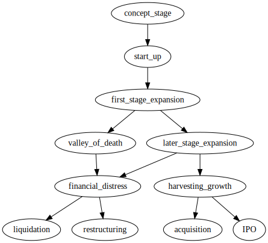

# Lecture 1 - January 03, 2018

## Life cycle of a firm

## Stage 1 + 2 Expansion

- Need to raise money to develop products
- Hard to raise money to meet rapid growth
- Where to get money?
  - Traditional equity sources are difficult to obtain
    - Founders may have to give up equity, typically reluctant to do so
    - As an investor, very difficult to liquidate in private equity
  - Traditional debt is also difficult
    - banks typically won't support
    - company's assets are typically worthless

## Angel Investing

- Wealthy, have money to invest
- Typically, not tied to the company
- They don't want to control the company in the early stages, let the founders develop their products
- Minority interest
- High risk tolerance, highly likely that you will loose money.
- Potentially massive time investment (to support the company).
- Need lots of patience, long term outlook, potentially need to wait for good companies.

### Why be an Angel Investor?

- Potential for high returns, but need a long term focus
- Prerequestite is to be wealthy

### GTAN rate of returns

- Companies with higher tiers of returns carry the fund
- The vast majority of the companies will struggle (i.e. not grow much / at all) or die.

### Portfolio Approach to Angle Investing

Since the returns are skewed (many loosers, few winners), it doesn't make sense to invest in only a few companies.

### Due Diligence

- Angels will typically spend a significant amount of time doing their homework on companies.
- Typically has a positive effect on making strong returns, higher rates of success. Comes at the expense of more time spent (higher opportunity cost)
- Usually takes about 2 - 3 months to complete.Usually takes about 2 - 3 months to complete.
- May need people on your team (or yourself) who are technical experts in the industry

## Follow-up Funding and Exits on ROI

- The companies may come back for more financing. As an investor, you need to have deep enough pockets to potential enter multiple rounds.
  - If you don't (or other current investors), other investors may see this as a negative sign.
  - If you do, it will make it easier to get new investors.
- **Down Round**: Raise financing at a lower valuation then your previous round. Can be damaging to the company.
- **Up Round**: Valuation goes up in subsequent rounds

## Venture Captial

- Invest in later stage companies (growth, expansion), typically in higher amounts.
- Invest in fewer companies than Angel Investors.

## Valuations of Ealy Stage Companies

- Early stage companies typically don't have revenues, fully developed products.
- Valuation is highly speculative, frequently convertable debt.
  - When the company raises money, the debt can be converted to shares in the company.
  - Typically Discounted share price in the deal
  - May also set a cap on the share price.
