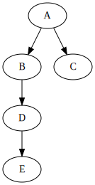

# Lecture 36 (Last Lecture) - April 4, 2018

## Bitconnect

- Transaction Alice gives Bob some bitcoins
  - Sends hash of when they recieve that bitcoin + signature
  - 
- Need to check a coins history, address double spending

### First Bitcoins: The Genesis Block
- Satoshi created 50 BTC out of thin air. this transaction is embedded in the software

### Double Spending
- Suppose Alice sends 2 transactions at the same time: to Bob and Chris. Both can't be valid at the same time
- Addressed by the proof of work, as part of the blockchain
  - All users have all transactions (peer-to-peer)
    - You actually create a merkel tree, root node is in the transaction, can then validate specific transactions without storing the entire BlockChain.
  - A user can volunteer to collect and validate all transactions that they've recieved in the last 10 minutes. Solve the challenge, create a new block.
    - Blocks are accepted if it's hash begins with t zero's and all of the transactions are valid
    - If the block isn't valid the miner looses the reward, incentivies them to be honest
  - One transaction will be accepted by a miner, the other will be rejected.

### Forks
- Block chain is append-only
- If you accept a block, then you continue to add blocks after it. If you don't append to it, then it is rejected
- Accept the block that you've recieved first
- The network agrees that the longest chain is the correct

### Mining
- Hard limit of 7 transactions per second
- Want the average time to generate a block to be about 10 minutes
- Increase the work factor every 2016 blocks, ~2 weeks.
  - If it's too easy, miners could go back in time, create a fork and regenerate blocks
  - Too hard, then it's too slow

### Security Notes
- Note that transactions are not insantaneous, recipients should wwait until a transaction (and some after it) appear in the block chain
- Otherwise, your at the risk of the fork which that transaction was a part of being rejected.
- Security relies on the honesty of the majority of the community.
- Change works as:
  - you have 30 bitcoins, want to spend 15
  - give 15 to Bob, give 14 to yourself, 1 for a transaction fee (for whoever mines it)
  - Alice would compute the SHA of both transactions, include that in the signature.
- All transactions are public (as part of the blockchain), therefore everyone can see public keys.
  - If a party knows who is attached to that public key, then they know your payment
  - Can create a new public key to mask your identity
