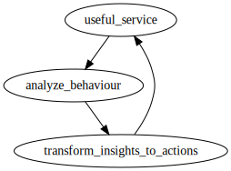
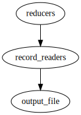

# Lecture 2 - January 9, 2018

## Why Big Data?
Big data has transformed Science, Business, and society.
- LHC, discovery of Higg's boson -> data driven
- DNA, diseases can be determined / addressed by the data

### Business Intelligence
- Retain data from it's activities
- Use that data to influence new decisions, optimize
  - More actuatally stock products
- More compute power, efficient storage
- **New**: Can gather behavioural data
  - What's clicked on
  - Where you mouse is hovering
  - Scrolling

### Virtuous Product Cycle




- ....and hopefully make money.
- Google, Amazon, Twitter, Facebook

Turn data science into concern data products, which then create a more useful service.

### Social Effects: The Perils of big Data
Importance of ethics.

- The end of privacy: Who owns the data and can the government access it?
- Echo chamber: You may only be seeing what you want to see
- Racist algorithms: algorithms themselves aren't biased, but data may be.

## The Datacenter is the computer

### Big Ideas

1. Scale out, not up: build clusters with lots of inexpensive machines, let volume drive down the price.
2. Need to engineer around failures: at this scale, components will break
3. Move the compute code to the data
4. Process data sequentially, avoid random access
  - Seeks are expensive

**Note:** 1 and 3 can be violated in some cases.

## MapReduce API

```java
// Mapper
void setup(Mapper.Context context)

void map(K_in key, V_in value, Mapper.Context context)

void cleanup(Mapper.Context context) // Destructor

// Reducer
void setup(Reducer.Context context)

void reduce(k_in key, Iterable<V_in> values, Reducer.Context c)

void cleanup(Reducer.Context context) // Destructor

// Partitioner
int getPartition(K key, V value, int numPartitions)
```
### Hadoop Data Types
- `Writable`: Defines a serialization / deserialization protocol
  - They must be transported over the network / written, etc.
- `WriteableComprable`: Defines a sort order
  - Keys must be of this type (not values)
- `IntWritable, LongWritable, Text`: Concrete implementation
- SequenceFile: Binary-encoded key value pairs

```java
private final static IntWritable ONE = new IntWritable(1);
private final static Text WORD = new Text();

...

context.write(WORD, ONE);
```

Once we write out the objects to the context, we don't care about them anymore. Therefore, we can reuse our `Writable` to save on Garbage Collection overhead of Java.

### Gotchas
1. Avoid short lived objects (reuse as much as possible)
2. The framework reuses objects behind the scenes. Therefore, you can't store references to past Writeables, they're all the same.
3. Can't use class statics

### How to get data to Mappers and Reducers?
1. Configuration params
2. Side data:
  - Mappers/Reducers can read from HDFS in setup methods, connect to a db, etc.
  - DistributedCache: Good for things like dictionaries

### Complex Data Types in Hadoop
So far, we can do simple ints, strings, etc. How to do more complex types?

- (Easy) Encode it as text `(a,b) -> "a:b"`
- Use building block in lintools/Bespin
- (hardest) Define your own `Writable` implementation

### Anatomy of a Job
- MapReduce program == Hadoop Job
- Jobs occupy a slot, to eventually be scheduled.
- Multiple jobs can be composed into a workflow

Job submission:
- Client creates a job, configures it, then framework takes over.

Files divided into many splits, readers read key value pairs (think cursor), passed to Mappers
- **Note:** The splits can be arbitrary, even down the middle of a record.
- Readers always start reading from a complete block, may have to keep reading over the edge of a split to capture the last record.
- (InputSplit, RecordReader) ==== "Input Format"
- Data actually comes from Distributed filesystem (HDFS)



