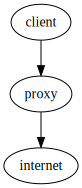
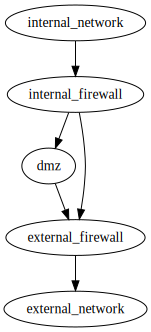

# Lecture 12 - June 11

### Active Code

Server's can have the clients perform computations on their behalf.
- Java, Flash, Javascript
- This could cause exploits to be run on the client's computer
- Can overcome this by running the code inside of a sandbox.
  - Contained, restricted environment
  - Attacks could be run, allowing the sandbox to be broken out of
  - Java 1.2+ can break out of the sandbox if approved by the user
    - dancing pigs, the user will want to see the pigs
- Similar messages (when asking for increased privileges) are bad
  - people will just skim over them
  - click on run

### Script Kiddies
- Attack scripts are available online
- attacks can be launched with little effort
- **How to defend**: Keep your system updated, then you can prevent against attacks for known exploits

### Design and Implementation
- Always check inputs: **Complete Mediation**
- use whitelists instead of blacklists
  - Blacklists: is difficult to catch every possible input, you might not think of something.

### Segmentation and Separation
- Don't put all of a company's servers on a single machine
- Avoid a single point of failure

### Redundancy
- no single points of failure
- backups, keep them safe
- important systems

### Access Control
- Access control lists
  - for routers: check that the packets are coming from valid sources, drop those that don't
- Firewalls: different machines that limit access / traffic

## Firewalls
- Must meet the correct requirments to gain access
- Put all of an organizations traffic through a firewall
  - if you don't, you will see an increase in traffic that's not.
  - Attackers will target sources that don't use the firewall
- Choke points: examine the traffic, potentially refuse access
  - blacklists and whitelists
- **Note**: Company firewalls don't protect against attacks from inside the company

### Types of Firewalls

### Packet filtering / screening
- simplist
- Check the ip addresses and headers of packets
  - Doesn't care about the payload of the packet
- Drop spoofed packets
  - if destination is inside the org's network (inside UW), drop packets if they try to leve
  - If destination is outside UW and tries to enter, drop it
  - drop other cases that aren't normal

### Stateful Inspection Firewall
- keep state to identify packets that belong together
- firewall may have to collect and reassemble the packets for stateful inspection

### Application Proxy

- specific for a particular application (email, web)
- Can conduct strong user authentication
- Example: protecting a database with a proxy
  - check if person has access to information
  - check incoming queries, don't run restricted queries

### Personal Firewalls

> Forbid everything unless explicitly allowed

- Firewall that runs on the user's computers
- knows what the user / app has asked for, check that it's been properly recieved
- Protect servers that are running directly on a machine
  - reduce unneccessary risk by not running un-needed servers

### Demilitarized Zone (DMZ)

- DMZ sits between an internal and external firewall
- external: protect DMZ
  - Use **packet filtering**
  - Want this to be fast
- internal: protect attacks lodged in DMZ from spreading inside.
  - More connections from the internal network, use **Application based**
  - We are familiar with the traffic moving from the internal to the DMZ (and beyond)

## Honeypots
- set up an unprotected computer as a destraction for an attacker, catch them in the act

### Low interaction
- emulates multiple hosts, runs different services
- Easier for attacker to detect

### High Interaction
- deploy real hardware and software, install keyloggers
- more complex to deploy, but harder to detect

### Example
- Suppose we have a database containing usernames and password, use a honeypot to protect
- use a low interaction honeypot
- create some fake userids that aren't associated with a real user. If someone tries to login as that user, raise a flag, then someone is trying to break-in to the system.
- flag: send an email to sysadmin

## Intrusion Detection Systems (IDS)
- Firewalls don't protect against inside attackers or insiders making mistakes
- IDS's are next
- Monitor traffic activity to identify malicious or suspicous events
  - events from sensors
  - store and analyze
  - take action
- Example: Sudden increase in traffic
  - could be a DDOs attack, drop connections

### Host-based vs. network-based
- host-based
  - runs on a single host to protect it
  - cannot examine other hosts, therefore they don't have the full picture, only local information
  - **Problem**: if the host is compromised, the host is compomised
    - the IDS could just be disabled
- Network-Based
  - Run a dedicated node which examines the hosts of all machines
  - **Problem**: Doesn't have the details of each interaction (only information in the packets)

Distributed IDS combines both types

### Signature vs. Heuristic based
- Signature
  - each known attack has a signature, try to detect them
  - **Problem** Fails to detect new attacks, polymorphism of viruses (changes it's signature)
  - Could use network statistics as a signature (typical/average behaviour)
    - gives insights into further analysis
- Heuristics
  - behaviour that is out of the ordinary
  - machine learning
    - issue: reduce the problem to just a few features, attackers could design malicious features the exploit these systems, get the same predictions
  - false positives and false negatives become issues

Both can be used together for better security
