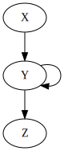

# Lecture 27 - March 12, 2018

## Network Dynamics

4 main cases for synaptic time constant and membrane time constant
1. About the same -> Need to solve both DEs
2. Other cases, one will dominant

## Recurrent Networks
- Layer outputs can feedback into their inputs
- Past states of the network can influence the current state
- **Defn**: If networks in a population connect back into each other, it is recurrent.
  - Have circuits

### Neural Integrator
- Input can be some function
- Decoded value is the integral of the input function
- Can set up a recurrent network to achieve this.
- Key point: If the input is 0 (i.e. there's no input), the integrator should hold it's value
- Note this essentially produces an approximation of the true integral
  - Even when the integral isn't changing (no input), there will be some drift
  - why? encoding and decoding isn't perfect, population state will drift
  - Tend to get clusters of values that the integrals converge to.
  - Drift to the next stable point.

